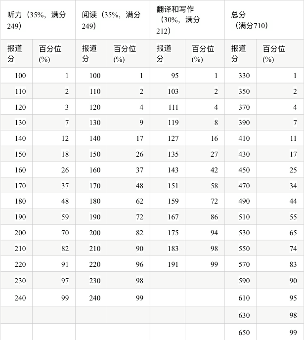

<div style="text-align:center">

## 四级备考指北

</div>

<div style="text-align:right;"> 

*by 冰原沙漠气候, icy_desert@outlook.com*
*欢迎指出问题或是提出建议！*

</div> 

---

明确一个非常坑人的点：
***不要报四级口语！不要报四级口语！不要报四级口语！***
***报名时官网会弹出来口语报名界面，别被吓到了！***
***除非你非常确切地知道自己在干什么，为什么要这么干***，否则不要报！
这是学长学姐传下来的血泪教训！

为什么？
***四级口语不算入总成绩，相当于你白考一次浪费自己时间，而且还当了一回散财童子。*** 

本文只讨论四级笔试部分。

---


### 四级成绩怎么看？ 

首先区分两个概念：原始分和报道分。原始分，也就是卷面总分，满分是100分；而报道分则是对原始分赋分得到。如果你不了解赋分，请先看下面的注释。
四级所用的赋分公式是
```math
报道分 = \frac{原始分 - Mean}{SD} \times 70 + 500
```
其中，$ Mean $是常模群体[^1]平均分，$ SD $是常模群体标准差；你可以认为是抽样确定好的常数。
最终你在官网查到的分数，就是赋分得到的报道分。
由于官方并不公布这两个常数，因此即使知道报道分，你也无法逆推出卷面分/原始分。

> **所谓赋分，就是通过某种原始分和报道分的对应关系，将原始分一一映射到报道分上的过程。实际上就是函数。**
>
> 赋分的最大特点就是，你的报道分数其实只是「你的卷面分在常模群体中排位比例」的反映[^2]。也就是说，和卷面分不同，报道分的数字大小本身意义不大，它不过是排名的另一种说法。新高考地区的同学应该较为熟悉这一点。~~当然高考赋分的分数意义重大~~

### 分项分数及试题组成
听力占35%，阅读占35%，翻译和写作各占15%。
各单项报道分的满分为：听力249分，阅读249分，翻译和写作共212分。报道分满分710分。
另外，四级*不设及格线*（官网原话）。

<a href="https://cet.neea.edu.cn/html1/report/16123/196-1.htm" target="_blank">官方的具体题型分布</a>
<a href="./《全国大学英语四、六级考试大纲（2016年修订版）》.pdf" target="_blank">《全国大学英语四、六级考试大纲（2016年修订版）》</a> pdf文档从第150页开始给出*具体的样卷*，可以看看，熟悉题型分布。不过，实际上作文并不是印在最前头，而是试题册最后一面。

### 考试流程（时间点可能有些许误差，以考前实际安排为准）

**哈工深考场不需要自带耳机，听力是广播播放**
正式考试时间 9:00 - 11:20

| 时间 | 事项 |
| --- | --- |
| 8:40 - 9:00 | 试音时间 |
| 9:00 - 9:10 | 发放试题册[^3] 、答题卡1和2[^4]、条形码<br>填写个人信息，粘贴条形码<br>***只允许浏览作文试题，禁止翻阅试题册其他部分*** |
| 9:10 - 9:40 | 作文答题时间，***只允许作答作文，也不能翻阅其他部分*** |
| 9:40 - 10:05 | 听力答题时间 |
| 10:05 - 10:10 | 收答题卡1<br> ***听力播放完毕后立即收卷，务必在听力播放间隙涂好答题卡*** |
| 10:10 - 11:20 | 完成其余部分 |
| 11:20 |四级考试结束，收答题卡2和试题册 |

### 备考策略
> 诸位都是能上哈工深的人，相信大部分同学已经有了自己的一套英语学习习惯；适合自己的才是最好的，**了解题型组成以后**，如果你觉得自己的习惯有效果，或者看完这一部分觉得 “这人写的怎么怪怪的” ，那就按你自己理解的来，可以直接跳到 [学习渠道推荐](#学习渠道推荐) 。
>
> 对于仍有些迷茫的同学，可以参考一下我的做法。但是，以下仅代表个人意见，不构成明确的行动建议。

通过研究分数构成和真题，我们不难发现，分值的大头是听力和阅读，各占35%；此外，它们都是客观题，而客观题相比主观题最大的优势就是：可以蒙，拿分相对容易。*相比之下*，仅各占15%分值的作文和翻译都是实打实的分，性价比实在不高。如果你觉得考高分比提高英语水平的优先级高一些，那么备考的重点也应该是客观题。

客观题的备考策略很简单——熟能生巧，毕竟都是客观题，只需要做做往年真题的这两部分，做多了手感自然就有了。一般而言听力的正确率低于阅读，因此笔者考前一周的四级复习时间主要是在练听力，力求在听懂大致意思的基础上，记住尽可能多的细节。至于阅读，题目本身并不会绕来绕去，难点在读懂文章意思，读懂了做题基本没有障碍；因此笔者聚焦于文本里的生词积累。~~才不会告诉你们做题技巧都是吃高中老本的呢~~

至于主观题，作文一般是议论文或者应用文，想偷懒可以吃高中老本，也可以学习各种资料上的范文。翻译的话，就只能靠平时积累了，译肯定是能写出来，但一些中文有固定译法，评卷应当会参照贴切度扣分。

### 学习渠道推荐

上手就做真题，不需要做模拟题。
 - 从你看到这篇文章，到四级考试开考，中间不会超过四个月；真题的数量已经足够你找手感、研究了。（仅个人体会）
 - 模拟题质量参差不齐，既然有权威优质的真题资源，何必忍受模棱两可的答案呢？

笔者用的是「四六级黄皮书」，体验极好，列举一些优点：
 - 真题数量多（事实上现在还有3/4的题目没动过）
 - 答案分册，方便批改，而且有详解
 - 附赠听力音频
 - **完全按照官方试题册进行排版印刷。黄皮书上的一套试题就是一本试题册，和官方的排版一致，可以让你提前适应考试风格。**

市面上还有不少大品牌出版的资料，你还可以多搜搜，货比三家，看看别人对它们的评价再做决定。

此外，有学院也会在考前一周组织免费的四级模拟考，届时可报名；最大的作用是适应考试的时间安排。~~试题当然是模拟题，质量不予评价~~

### 考试用处
- 获得六级报考资格。四级成绩在425分及以上者才能报考六级。所谓「低分飘过四级」指的是分数在 425 上一点点，并不是及格的意思。
- 转专业。不同专业转入要求的四级分数不同，也有不要求的专业。具体可查查各学院的转专业要求。
- 督促你学英语。这不是一句套话——***大学的课外自学资料，有相当一部分是英文版***。
> 目前（2024年），哈工深毕业并不需要四六级。但是，*毕业不需要 &ne; 不用考四级 &ne; 不用学英语！*

---

### 后记
写这篇「指北」的动机，来自于在23自救群的见闻。无论是报名开始时群友「不要报四级口语」的怒吼（？）、不少人报完名才知道可以不报的感叹，还是考前不久有人才知道四级做题是强制顺序，都让我感受到信息的封闭。

诚然，四级官网上有详细介绍，但一来这些网页较为分散，难以整合信息，二来对没考过的大一新生而言，仅凭 ~~不知道多久才更新一次的~~ 官网信息，想「居高临下」地一览四级考试全貌，并不容易。因此萌生了「写一份四级备考指北」的想法。

这篇指北面向新生群体，目的让大一新生对四级考试的全流程（包括备考过程）有一个比较清晰的了解，减轻未知带来的焦虑和迷茫；而不是介绍四级刷高分的技巧。按照笔者的理解，无论什么考试，要想拿到超出常人的高分，大量刷题是必不可少的；这已经超出了本文的写作意图——毕竟对大部分人而言，四级并不是极其重要的考试。

本指北中，相当一部分资料其实是引用或者参考自四级官网，感兴趣的同学可以探索一下：
https://cet.neea.edu.cn/ 和 https://cet-bm.neea.edu.cn/

[^1]: 官网的原话是
    > 四级考试的常模群体选自全国16所高校的约三万名非英语专业的考生。  

    但也只说到这，没有给出更多信息。


[^2]: 四级报道分---排位对照表可参考下图：
     
    事实上，以上两个注释都引用自 [官网分数解释](https://cet.neea.edu.cn/html1/folder/19081/5124-1.htm) ，里面有更多例子。

[^3]: 试题册，顾名思义，就是一本薄薄的*装订好*的小册子，跟高考试卷那种一张长卷子不一样。

[^4]: 答题卡1：作文和听力共用的答题卡
    答题卡2：阅读和翻译共用的答题卡